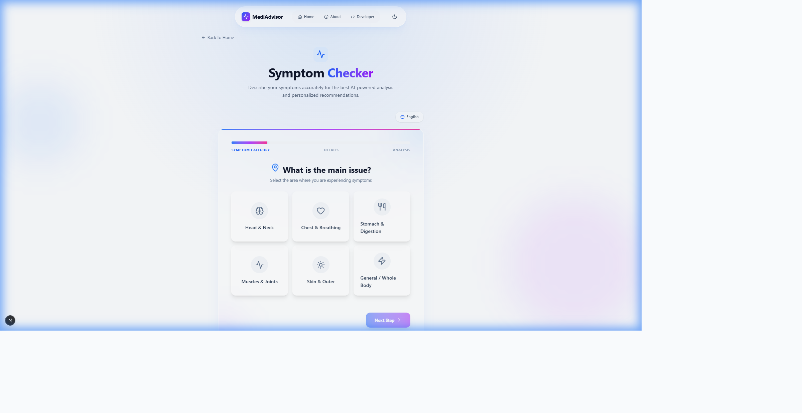
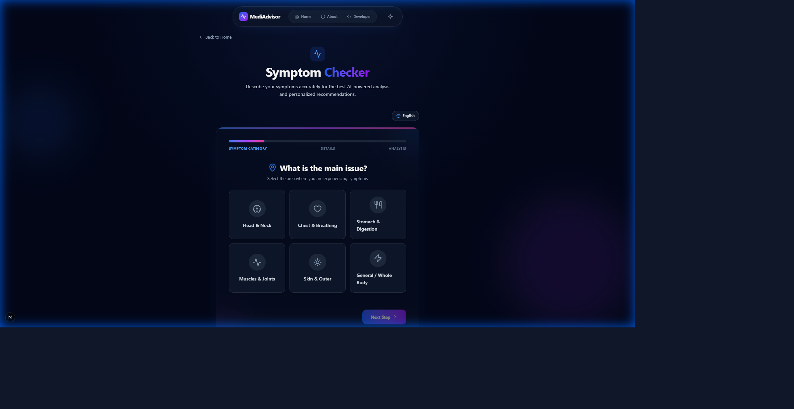

# 🏥 MediAdvisor

An AI-powered symptom analysis tool built with Next.js, Tailwind CSS, and Google Gemini AI.


## 📸 Screenshots

<div align="center">

### Symptom Wizard - Light Mode


### Dark Mode Support


</div>

## ✨ Features

- 🎯 **Multi-step Symptom Wizard**: Interactive form for comprehensive symptom collection
- 🤖 **AI-Powered Analysis**: Integration with Google Gemini 2.5 Flash for intelligent disease prediction
- 🌍 **Multi-language Support**: Available in English, Hindi, and Telugu
- 🎨 **Premium UI/UX**: Glassmorphic design with smooth animations
- 🌓 **Dark Mode**: Full support for light and dark themes
- 📱 **Responsive Design**: Works seamlessly on all devices
- 🖼️ **Image Analysis**: Upload images for visual symptom assessment

## 🚀 Quick Start

### Prerequisites

- Node.js 18+ installed
- Google Gemini API Key ([Get one here](https://aistudio.google.com/app/apikey))

### Installation

1. **Clone the repository**
   ```bash
   git clone https://github.com/Vijayapardhu/MediAdvisor.git
   cd MediAdvisor
   ```

2. **Install dependencies**
   ```bash
   npm install
   ```

3. **Set up environment variables**
   ```bash
   cp .env.example .env.local
   ```
   
   Edit `.env.local` and add your Gemini API key:
   ```
   NEXT_PUBLIC_GEMINI_API_KEY=your_actual_api_key_here
   ```

4. **Run the development server**
   ```bash
   npm run dev
   ```

5. **Open your browser**
   Navigate to [http://localhost:3000](http://localhost:3000)

## 📦 Deployment

### Deploy to Vercel (Recommended)

[](https://vercel.com/new/clone?repository-url=https://github.com/Vijayapardhu/MediAdvisor)

1. Click the "Deploy to Vercel" button above
2. Connect your GitHub account
3. Add environment variable:
   - **Key**: `NEXT_PUBLIC_GEMINI_API_KEY`
   - **Value**: Your Gemini API key
4. Click "Deploy"

### Manual Deployment

1. Go to [Vercel.com](https://vercel.com)
2. Click "Add New..." → "Project"
3. Import your `MediAdvisor` repository
4. Add environment variable: `NEXT_PUBLIC_GEMINI_API_KEY`
5. Click "Deploy"

## 🛠️ Tech Stack

- **Framework**: Next.js 16.0 (with Turbopack)
- **Language**: TypeScript
- **Styling**: Tailwind CSS 4.0
- **AI**: Google Gemini 2.5 Flash
- **Animations**: Framer Motion
- **Icons**: Lucide React
- **Theme**: next-themes

## 📁 Project Structure

```
medi-advisor/
├── src/
│   ├── app/              # Next.js app directory
│   │   ├── page.tsx      # Landing page
│   │   ├── layout.tsx    # Root layout
│   │   ├── globals.css   # Global styles
│   │   ├── actions.ts    # Server actions
│   │   └── symptom-check/
│   ├── components/       # React components
│   │   ├── Navbar.tsx
│   │   ├── SymptomWizard.tsx
│   │   └── ResultsDisplay.tsx
│   ├── context/          # React contexts
│   ├── lib/              # Utility functions
│   └── types/            # TypeScript types
├── public/               # Static assets
└── tailwind.config.ts    # Tailwind configuration
```

## 🎨 Design Features

- **Glassmorphism**: Modern frosted glass effect throughout the UI
- **Gradient Animations**: Smooth, eye-catching gradient transitions
- **Micro-interactions**: Subtle hover and click animations
- **Responsive Layout**: Mobile-first design approach
- **Accessibility**: WCAG compliant with proper ARIA labels

## ⚠️ Disclaimer

**IMPORTANT**: MediAdvisor is an AI-powered informational tool and is **NOT** a substitute for professional medical advice, diagnosis, or treatment. Always consult with a qualified healthcare provider for medical concerns.

## 📄 License

This project is open source and available under the [MIT License](LICENSE).

## 👨‍💻 Developer

**Vijaya Pardhu**
- GitHub: [@Vijayapardhu](https://github.com/Vijayapardhu)

## 🤝 Contributing

Contributions, issues, and feature requests are welcome! Feel free to check the [issues page](https://github.com/Vijayapardhu/MediAdvisor/issues).

## ⭐ Show your support

Give a ⭐️ if this project helped you!
